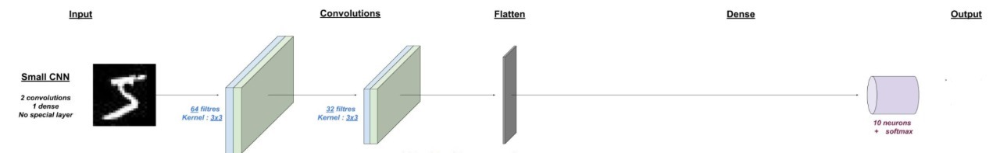

<b><h1 style="text-align:center ;  font-family: 'Times New Roman', Times, serif ; color: #C8AD7F" > Handwritten Digit Recognition using CNN.</h1></b>
<b><h3 style="text-align:center ;  font-family: 'Times New Roman', Times, serif ; color: #C8AD7F" > Introduction :</h3></b>

À l’ère actuelle de la digitalisation, la reconnaissance de l’écriture manuscrite joue un rôle important dans le traitement de l’information. D’ailleurs, de nombreuses informations / données sont disponibles sur papier, alors que le traitement des fichiers numériques est moins cher que le traitement des dossiers papier traditionnels.

Le but d’un système de reconnaissance de l’écriture manuscrite est de convertir les caractères manuscrits dans des formats lisibles par machine. Les principales applications sont, par exemple, la reconnaissance des plaques d’immatriculation des véhicules, le tri des lettres par code postal, etc. Tous ces domaines traitent de grandes bases de données et exigent donc une précision de reconnaissance élevée, et une complexité de calcul bien réduite.

<b><h3 style="text-align:left ;  font-family: 'Times New Roman', Times, serif ; color: #C8AD7F" > CNN :</h3></b>

CNN joue un rôle important dans de nombreux secteurs comme traitement d'image. Il a un impact puissant sur de nombreux domaines. L’un de ses utilisations est la reconnaissance des chiffres manuscrits.

Dans ce projet nous allons créer un réseau de neurones convolutionnels capable de reconnaître les chiffres écrits à la main avec une précision de reconnaissance élevée et une bonne rapidité.

<b><h3 style="text-align:left ;  font-family: 'Times New Roman', Times, serif ; color: #C8AD7F" >Banque d'images MNIST :</h3></b>

Dans ce travail, nous utiliserons les images de la banque MNIST
- La banque MNIST propose des images en ton de gris de 28 × 28 pixels, correspondant à des matrice de 28 × 28 d'entiers compris entre 0 et 255
- L'ensemble des images du jeu de données MNIST contient 60000 images d'apprentissage et 10000 images de test, soit en tout 70000 images de 28 x 28 pixels.

<b><h3 style="text-align:left ;  font-family: 'Times New Roman', Times, serif ; color: #C8AD7F" >L’architecture :</h3></b>

     
    

